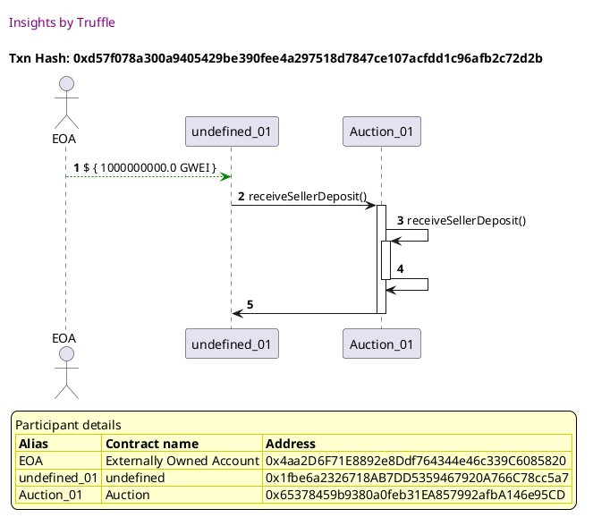
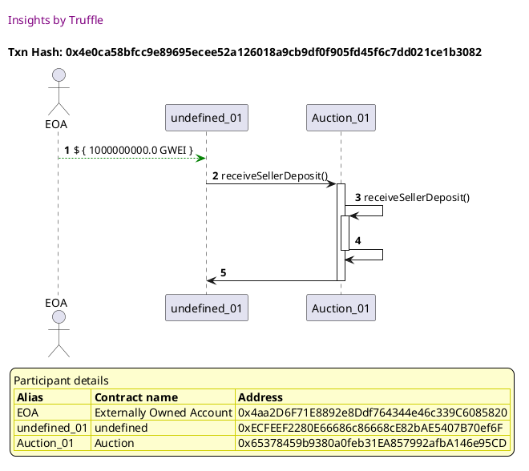
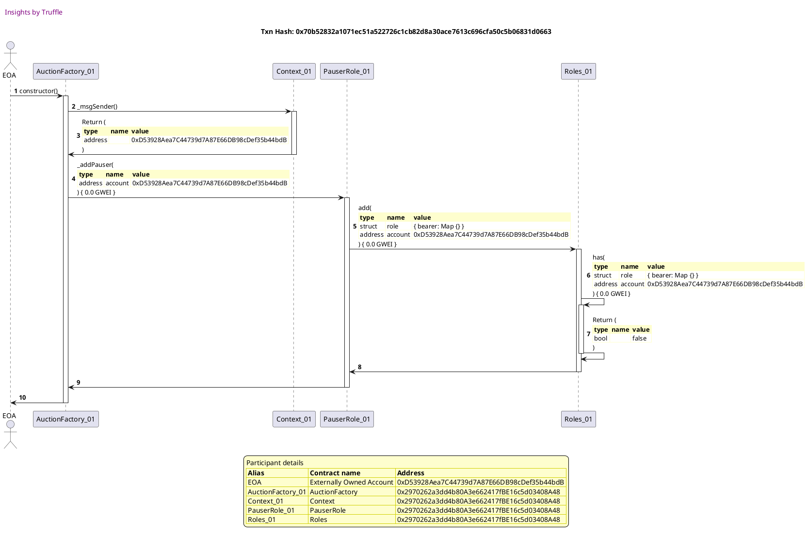
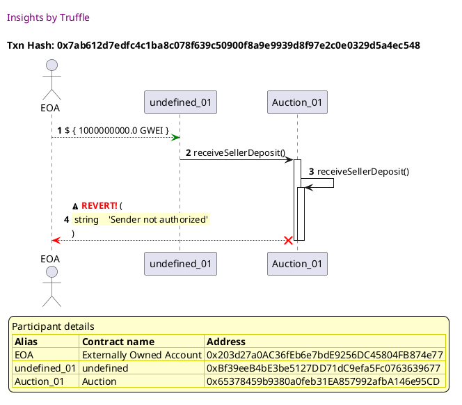
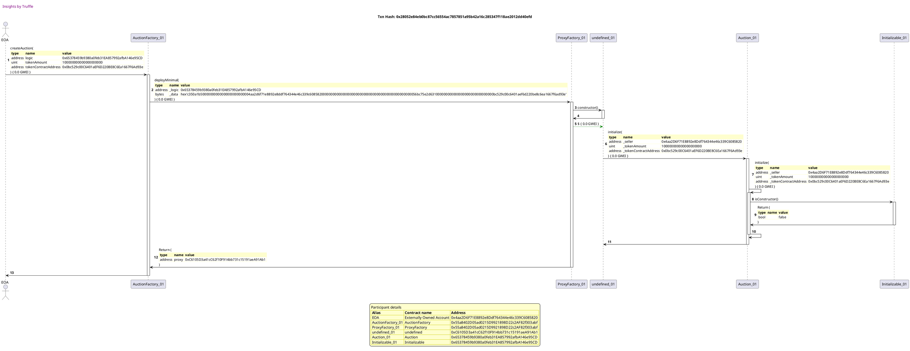
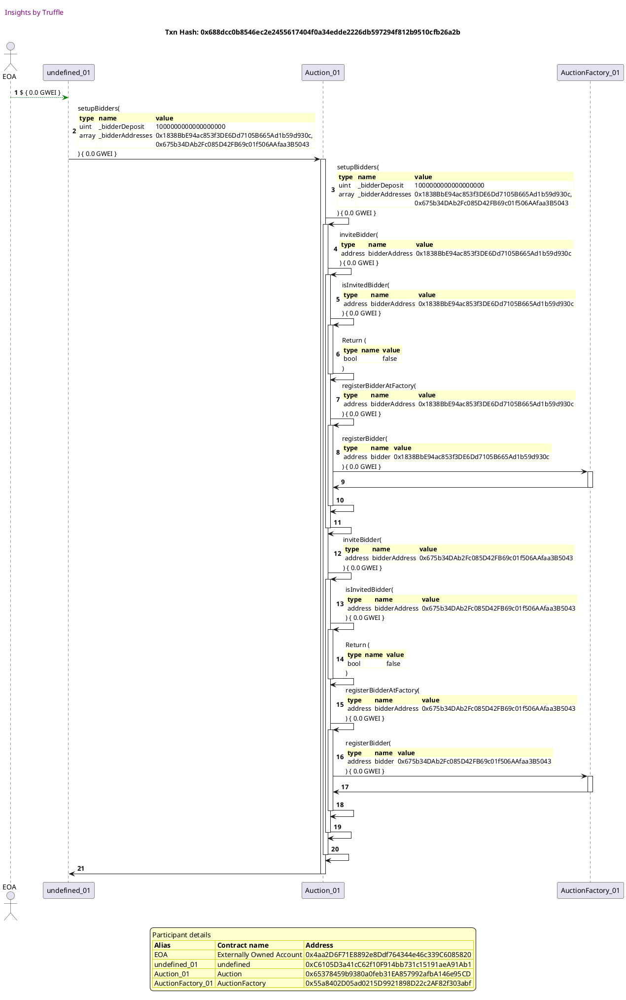
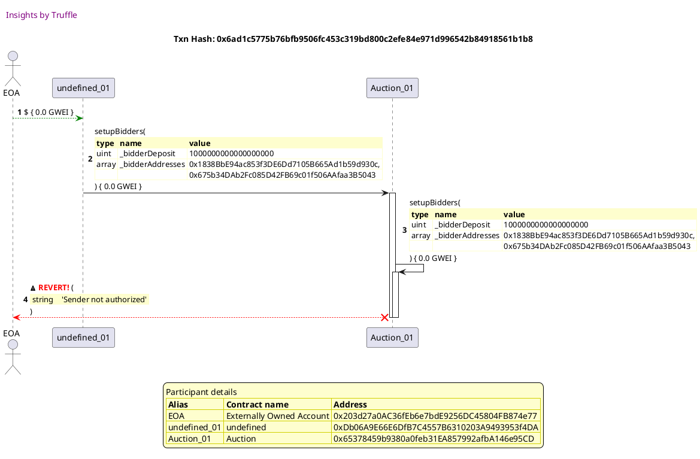

Test date: 2021 Mar 02

## should accept a deposit from seller
[link to test...](https://github.com/michaelsmueller/gloom/blob/main/gloom-core/test/auction.test.js#L36)

##### d1, tx: 0x944b11fe7cdc8556b2449f8fa3962c73941a689c2108bf58268c8d7cba7cfe58

[SVG :telescope:](https://www.planttext.com/api/plantuml/svg/tLPBRzim3BxhLn3TfSFMpNOSFu8kgFDQUnXQj0LsAL38jfmOLUH0ahUaIV_xw4VSk6qEQx3B3CEKA3u-YXHbGiwKfbBdSqu8pNKcydd8954FgLXGIUV0sPI9U42ZXwdCSX4FCvv9-30PJyR3CI6dIgyuwnCedncZCPEmhgS0vvbC7pEXAGzuEXLp9ZHQJ7GZCC75okGYbmlEMWitwIC3qsvuLpIEKp45qwXPJoKz_Lg38BN_2w7IwKmh25TmA_CaGRj4fvepk5qAEATgrWDZwTjsQ9e9SwCuyhfT9xHisq-yX7PynuhSZc-RrF7yo38DBqowdkLuaHUxKKZTA65TZ-2MHHgXZoy3e0gEa1uHt3QTHkc2OgX17kaq4vDIR7LlcANOAsvRQOYHiwNUIZzFss9ND5TCNcUSRILRdBPmmLHRkUtaY90ICfpqtm85dpxr8Cg4qZ8lcCSVoLjIXV8EnbBhVgwcDrWsh5JQNTtZwkIa1zTCvrB0yPsu8wTrWNskQN_p3VHgmG2feFEI_g8ynq4XlW6i3CcKWWtWQon7tOvlUG6Zxj2sCPEn6tZks7560z-BHYpfT4DCVZoerFS7rjxIAZPqLR4FHKgZ24-KVWzWM8FnnO3lFySNU0XUmYoGDqakGQFJzw6jaeyG9Tf3ieQGKSba3txG1QoVuEbVnlKSnEkGPbJzJo4TV0B2BEDL-IUKAzPKTjlXoqf1hs-MpvupklUWL7saa23LZK6kTjfFp3HDkTe9QcIC3CCeWiAB0PiI3ees8T5i4rwmtVv6hxyfUor-bvf9GJbVmULlmM88tfMWNSElU_LBNccS1d7GCSQXORgc4nlM8BRCm7D6dT3nXu7hJQXhMqF7R1lVwUdDv01pxTw_Ep_0Q7D7rCE_DOL9hrDFpl2BlnH_0000)

##### d2, tx: 0x66589f8249fe61ed9a8681fc95abb64032c4d60977dda05cdb71bab1d2ca812c

[SVG :telescope:](https://www.planttext.com/api/plantuml/svg/xLVVRzis47xNNq6a0zgYoqRg1oK5ML15bjSy50sw0djOXu0YJmuHcZ8aghDJxtyV9SkUBRa5d61l8mnHEXsFTzzt9vuTvsrjM6MQkN8SrfXID_CSAgT-a7h1AZP72cQWnJNZ3xEgRBH8IrLMwCKqcsPfvZYNjLafk79GD-w12QZGr_uHeNTb9HzBRPXAb9pfEMXZBHPcfp2rBpSc5qsrK73muZVv28ZuEzaj4qBg6IAu5_tTpPS_zquu_VutkfQpUrEZV8K-LKrHMBkEaKO1-hJKw1shxoyGNb8QH74HkNvS02KWOXRHY1Gy3bYUKnzxBlS5nN4O2i5mm4KUafpbHBYSHSJbZeMC6-jwzY51h4PdTZvpB6n6ShbWDjIauKQMUjgfhUumwTH6qiD5jrMvN0sM36I72omhK4WDOgkzBpZgqC2JaTgDbaOo9HzPhc2hF1IUEKuNCJg_EXOJUlFc0l4Ac87-vQlF-hDpsQVEZ_ryjVu5cTK2a9qrctVp5wOQUzEghv7bl8AwHckaofdaThRC1LuO-K6Snrw46IuWzqYMH44OnouhyeJu5E8WdMnjDD86jKQcV02Tp6qQjqy47ndZNRj5gSt6oiQMxCHuYNCUk377EBMvGbWsfHFNnTTPbDAC4Kh3AKr4xFM1l4PV4Vu9erz_psvitXu3hCLnI7I7ee25AbVlfPPpffwBujtJOSnN1ZeJWXbcvtjOlkHUW1d90_oDuJFc2bg41A8eTY4IeWYfx_a--9HxNimfZeB8nIUEWEOy3C2QziZtDRSiyOubAAYmBEKGSGeTImLbBKilZzCqugCbwQ2-DdbUwjfKJQlswhKpK3ZAw_dv1Jfc_eyNimf0_pdUvmBzC71klCrUGNT-oMtDmhFJfWQbxBUrpPkMqmcTXYJRS3ePS9hsd0xAx-v9zNVttnRW_z0z7xhHoR01i4uFgsAiDiIzBOgFO9fAewU1dfUbiW7QNy5KlNN_-sHlAd6eCQYjRrJhyPFlsM7yI-6YtRAZZ1GvKEPwBWr9b5o7aqdW1R5FmzZ5IKXf6aQS1omSnZpqTtDaj_4uczxEkTqx-GKO9bMzv_84JsnojIxR5ixs0VPccr4xvtUfjLjtjUww8djT6gWqKsg5FlnbuKG9vtqMdr8D-uR7NTLGrXbdYKWydEMOX8GAx5uBboGHdNWvZTCaZAOizDsKaaFZm-xhKF8CmmTTsjxZYUGU0U80WHCFzdrpewvl83hLjCsjFiESj_Pg_sFy0m00)

##### d3, tx: 0xd57f078a300a9405429be390fee4a297518d7847ce107acfdd1c96afb2c72d2b

[SVG :telescope:](https://www.planttext.com/api/plantuml/svg/hLFBRjim4BppAuYaXnQfM-f9qKYDA9RSv9G02T13KHGKkNA8o9H1KQdpwBzthJYkxLxB0wdTdHsImn4XPvsNplUBXX3P-zRsYmeSwUwDNKed5xI1ELXzBjNztBMzrTEsQHqzdfMpSbeISjhvnmOcX0xZ3gG6Hvyt8QKNhJDFhVMooHipjmkm7XbhlmNCiFXAkUpTie6zmerv0Xh4szorrDhOEGtO9lLxM4y_Rmv1DljVsixCxtn7gqTww_gwHbxYZM-0tguilP3TtPYobKvupNWc8yQaY5aIXwA2IB0Q89QXu4cGQPx5N470k5Irre4IgQohKF5GXnL1oPJ7evTNEPKTFSBrYA1itYYpb7XLr0jgOq7_PC60s4tiG_DUUTFQD-3Vy8YGWPYElX_F7O3zCPeS4D4nVKUVKPQtyOdHhz_AIzJd0BXktQ6c9oTZwa21UO0RQ1fm1IpRplZt7yWUxd_rZKPZ-Y_Yu8nh37dr7RdUaKY3bwRfoEd6VH-F2rRWRISlNoZQ2sN3Zodwnk6pK2iNi4xaMZleiBRjcxmCBuRpoeEpicaUwTKlt9xcIg77FPROAfOoBD8P3yei4o5aXQvv6aTn376geaXCKvObMSZsYVTUV2SSA8EwWbI6KPZo8ClFUL4aKIBYb8kGvJnDfpnJAf5ydtB76TjWe4kJ2EsPY4f46PDesoeAoZnBk10XkZGFuXH4CYsG3gNS24hESCRV_Gy0)

## should store the seller deposit amount
[link to test...](https://github.com/michaelsmueller/gloom/blob/main/gloom-core/test/auction.test.js#L40)

##### d1, tx: 0x6aa8985ff7b80cd258209bcad7b27dc1663ac1bdad53383df899dc1d7c879fd4

[SVG :telescope:](https://www.planttext.com/api/plantuml/svg/tLPBRzim3BxhLn3TfSFMJOcTs0wwe7auQmz3YxR0BWKAsP8JeuuSIFAMDEb_7_s86xVDOGrsMH2O5lMH_2XHb0avquOfayqJGbXcKfdD0w68VeZbWYasXqHCXUH35ZvCLPf9FagJLC67YJ_nHpuXfzgi4j4dKFncWd6XO5qD0SvJ5J-cqh1aaCHJEHVIeCV8r809JfOk5vbQ9A8nSHC_2cZPjUwASHxBARHefNegvEdNYWIfubz87KzdHaEmWbkLHH7w9IOsYO3RfOHpfcSzeCikOwxdTgB82LmQydR7RLCl21btWhR3mrQtQx6m5N36EvRbMZnoFG_Lt0bTnukuJN39GeFK_Si1C0r7A8y8Bfk9mtZ1CDL15feubPC2jhgdhGBsIjiq6c7cOccswETX4tR5CYtKTPg8BRAXQO9pfTxYjeCZGWhASD9_YnHy-jI3C9NQg2nN7dyaRw5ounsEXTNzN4zli6n4ORGxkoVKoKaFheN9b8JZEtb7Jgi2-rp9_kORcDL204h9veNynP8CNtBu1h0obD0QDe1_kXntBA_j3WHpHhRjM1vt1gxZTxlZeUU6On5PdS2s0puipVSdrbpICZSCLQeFPSh244-KUGzXM0FzGk7xJ_y23y5BcZdpUfCBqXZqVMpBpKUA2lsXM4CWc1Ag1p_O0jPFyFGlytfEudLACwR_fvGEFW51cYPb-KSiqQAkx6R0bvM2KTyidprdTEz1AVj8ZY3bZK6kTjeF5uR5YTv9Qap7bD8yARmOi2dXIzuc5Bgjqnjibx-sws-ANelFfH5AiYHPmULlAJWCthL1kuvVz-gNkiAvvtJj5XrP4NUvR_biwDeUzJgqxRcjBXN-X0L-Q-ZOJUSxFRqU7E2ksVjtnmSuhU-8wlLlNU6cLrjFpl29dnH_0000)

##### d2, tx: 0xd49d6380813e814e0ed4bb67de480d162300db4d396730bc05c352bb0923cf6d

[SVG :telescope:](https://www.planttext.com/api/plantuml/svg/xLVVRzis47xNNq6a0zgYoqRzegGW2ohBr9g7ea5NO0_h453YoI52KuP4TNRg_U-ZPDcp9RU0O-njX25Af-FnxllknBDblQqrgtGpbvR56bsgPfv1PTMFGYrOnUP8mWmKdx3ySLQLZU99ASiAlKXfIXDgMTUrNacuiL0t7e1ngD3N_X6XTsKbdagbcOobcAavA6qi5dgda9gN6vEBfbf8E7ZnctW2P7ixsHtZNAWPid4l-hkRht_kdR3w_MzLBMOFkaRP2dsgcg8mTYqjj0JqQQdGErO_N26yv5x4YHlYq7OXj3t0mBqi8m47ByJS9ewBCSyyxaOaS76MOpztVIVBSEIuUK6uPI3BjN6TVeWHgz65cIyi0viMkLWm4shSv5gKAktKLlVOxjH6qiD5TrMvN0sM36I72mmhK0W5VAkzBpZgqC2JaTgj4bemAPvO9c6hF1HUM5ONCRgyEHOJUlFc2kKLC0tzorUVrMVhka-T7_lvPlqBqgi583ChDk_cBqmsvgPLNoF3UGLrZTP8bZEHcnalYUy6eUT7MMJeOxY0pBLf7Ff153cio6BR8n3voNHhen4cg3NIvIEeU6xIk7soyP4nthLRb9Xih4niyKwCboOZV2VACKw8Xsr6Kp9r73oXOK8eima9KXBpoEq3UOs-8lmJHh_-JczDtXu3hCLnI7I78eU5B5VlXH9p9iz5yVxvC6Oh3Pq9pZGpymCiNvgImCpEVFoDuJ7cS584DeHXv438UH4Gp_Kyy4Zkkb5ESEY73Zvn-2JB0n-CQTV-lkQMfRnZ2KpT6fOo27C27Ki5OIrBBu_JDEAZ9UcWlZPvNgfQLqshzkgrDL0uoklbvHKwPlwF5xCAGFqvtkSA_J1mRhpDNa5tVebjpSBPQLE3bERRskPDo-cKf85DDvnE1vmcFQU3yhj_LltT_xS5-3zqvqCtEXas0DR9OLMCrOQujqNn4NHJAVGyqBEob2P0yokOhBVkVv_iJIKEDGQrzOrgFNxodHt6lnGksYqxocYIKfewJeWf8IGaUTXEEGsTBAQ-XuD9WCtNBHt6FFHtSsItyLYRtiwwsplvEMWcPBtdyXHFJNArBfiMplG1vcQRKJldTwcrMtUpxheYSrrgg1IJSeK-_6NWH76UzrbyIZNi6nvtLKDPPpmofcoSk0KFENKfcuHUX2CVEr5e4mmqPHcr9u5tQ7pOVHrApZ1yqANjFPv8xX4W3X0uyM3VDpVg-WQYKqsRtEepp7fhhkO_nZy0)

##### d3, tx: 0x4e0ca58bfcc9e89695ecee52a126018a9cb9df0f905fd45f6c7dd021ce1b3082

[SVG :telescope:](https://www.planttext.com/api/plantuml/svg/hLFBRjim4BppAuYaXnQfM-f5KOPhHB6b9gS4I80UYgAWo9LDHAOCYahpwhzthJYkdLxB0wdTdHsImn4XfvsNplUhXX3P-zRsgmeSwMwDNKidLxI11LXz9jNjmhMzrREsQHqzBekoc1M4J3h_qC2Kq64iGMfmz6aRKdhUElFOMY-Rl34BkmBhaR7sEq29nHVATU_M3HmKhiqZq23UvQwariOkQC2sgT_3ElcyFGJPxdzXExDO-evM3_J6zNMDlCGRtm2zkRVqN7RBCMNtCJ0b4r7LIcKWCfube02IK0OXPu6GcQeoNRCwOqcjuwJcAjMQXO62e8gO20bAfZmUlRZCgUpe4Qv716NpHfcrnAkYNb0R2_ed2mR4Vk8GclVAczQ-0l-6HuGCn7Jq_NZX0EoFqVGD4HtJT_G9PNaTdnZz-gsuG7tU03UjUzJqv6HC7TxQtC4rD0suEQpRplZt7yW1xd_rZKPZ-Y_YpHat6FBYEtAr9v46BqtJaSdMVH-FvsoEjvq-Vw5eBvGDFsRe6uVFGgrSmIQHQ-sWmzgkR_eyl1ZEznwSbKtpG2z_uVOqLmezxh64xf0odFCo3GeXiX34NDSfZwCuXfYhACfcd8b4XEoG-E35zyA1ifYLHL66eM05vrnm9JQBAaHOvKKIi_GiPL3pyf1opncxOA3ZIPIAECcgB19CiXggA2XoaQHP5igwoeEOGvRCvaY7Kcu59QSuu-_-1m00)

## should not accept a deposit from someone other than seller
[link to test...](https://github.com/michaelsmueller/gloom/blob/main/gloom-core/test/auction.test.js#L50)

##### d1, tx: 0x70b52832a1071ec51a522726c1cb82d8a30ace7613c696cfa50c5b06831d0663

[SVG :telescope:](https://www.planttext.com/api/plantuml/svg/tLPBRzim3BxhLn3TfSFMJNuxGHVKUQqz32tQ0hiKA6HPIOmgSY39MzAa_tto8sxSDeSrs6L1O5hKH_AZH556w4nf8dK-vmYHN6SYdyTC8lMGYWMHP0wSJPb8-eG-J6MMYsIGyKp2X_5eF1gC43fLUiLP3q7vcp6IC0dhUWXmdidqCHEQy8YdKp5dGXkF4zq0ncQoShd8vOApriHD-iZ0SXlT5KcIL4p1mhNggPIdNsiIg8v_8LGwdMa5yGfkPJwP6Bz8fvepk5qAE2TgrWMy373isQ5Z4mi75gEUHJpR3coVMZGExIGa3YQK1RxbKB_ZqmdnCFLYx8UEbM3VTv1PCgeDzT5b14J1aP57o2oRJccw82RLAASwpSIuXAtkiLN2NcdRHWEJELlgBVfvs8PTaLmnUPrnjaMsD6rmeLHRt7PmX5196KvwRv62Jv-wG3EXjCmBvV57z1QgCDxXM5hTpzNqnfGDAursP_U4EZdfmZNJkHHmV2Vkq6bTO9zhsTjy0xrQC31Ia7afVn6UcvS2lW5J6P8f1HimVxmSUax73YD6We7h1aud2Q8m6Fd-iDy9wP1D72zstJZfL-Rx4silQPMR2LMf3sLAA3KdIh-7CAm1Vy7m_UVemXo2bpGBviqcbwHDqFUnhJRVK9J6dn5hY1cHJ7RX1rd0-WcU_cLUpqcyJcb6rF-Kqi4d8CuoNfN_X735cifk1tnPAIRgc-MpvupkFIXL7oaGgBenqDLE-qcO9YbNEqaDyH1ZN2HbBWRJbCnBqIQaSTka5ssNlx7hRSfUQvvBpQGWdA_WyhTW2KJlsg1TnwzxzKjTwTpk1DZsRU8aYHk7E7AOxzkk5Kpw8ykdNe8T5uUH6xQTx_JqPd20ktRltnqVuBIv8-hNltLbDhtUUdHcdkQJuWy0)

##### d2, tx: 0xc16b4624eabfa39de362d94b2369ac22c864a919cfeca532a656e8f2c6564156

[SVG :telescope:](https://www.planttext.com/api/plantuml/svg/xLTHRzis47xNho3I0MtHPQD4YPA2BAXiosiUYWPTWJsiGq2H9uS8JHaIrTcfzzz7oR9dIsu1nzZR1CCddOx7k--xCy-EyxOoh3JrN3aEgqsXwta6fLCzIhrW9PiZ1JFGOiJuuwmiQYt6XIfAz6AQJjDnwZZNbLafk75GUpq04r2YhzqZGk-AKZuLsZ2LA3dJSz36UipDpc1gNsvSBkfoeU3WnM_o2P3hxtHtJ0YfPyZ5dUhlLbx_t0NXTFlVwahE7ao5iXNwLDPvRlqwHXe5wDDIetUiUhX2UCbTcldKyu5bEIEn048z4VkPHsZCkEVnYFeiTcEU0sS1yHWDA4IvnwtqtO0w5Z9kREZfXmIn2brOUU5Os8paSi5igadDZIpqj3LRtMEtDHje3nVTbSLorLlIqnqkiAn0BZM8hVM-ucX0lKW6PhTQ6icKV6APWgrnNtdXE6t6wFBcM4xepPihn4jW1hgNhpxhpyvrLpe_Tl9c_GiogmKWApMRj_8BKxMzQSpNo79UGbMXDLB5J78hyP8698py8CvY4c66SyY8coPH4CQnn_8iSNqASJ2UR7tKqYQrHgPu19tCRHatJou-SWrtRHUDRJMMDhTafyPBdF70Ypd6O-fZbwLJEl4yF4gZCKsPIsaufOc8IPV8Q_GLuPym-lNtzDRMxJ706XpxHBSe2bYeOlLUQZbdwbmKxvyFOxOoqBeGp30h7s3vafC0CpSBy3Skdp5Fq3nq8OfY3o8Xyf3wnFV1fvoGc5CS1P67Jxm2cl4m0EkQkD-ttBB4MvOWfyAob474ARGivPGrBBqyJjE0ZuQaW_xQr7cXArFMZTchrqxFu2YlbvTNw9ZxFrxCIW3zvt2VA_H3BxZXDdiDtSObjpqBPvTD1KhPtzQcRXfE9tGQkkc6qqcFqt77QQ_zxf_LV_V_RGF-3ztvq0rEXWs0rVYmAuPcVToRflW8fYurUXxeML4ecw3zv4nLs_2_J_Qc4_iMlTxwHhSUF_dEJkDV2XVDbYrbevp402C_Iqa6WUk5aqdeYd4CEGkc78UKK1BJCEpdt8ztSsGt-JYRsSwvsplv1HWcLRKNyWHFR74r8TiHpiu1zcPRKRlWTwMrMtUpRgSY-xqqK6gcr0fz-Cl2YHBEkoe-fHls7G-dghwkTUx58VQenuWGVXRXX02rmvuRvgFKfJmGcFWuIlpeq7b_-ZhKdE7uO4hRUpoHt2D0721mui6-xsumzVLKfxgsjTLLcFFMVjl_6Fy0)

##### d3, tx: 0x7ab612d7edfc4c1ba8c078f639c50900f8a9e9939d8f97e2c0e0329d5a4ec548

[SVG :telescope:](https://www.planttext.com/api/plantuml/svg/dLJRJjj047tVhvX2LI2KihvxepIgapY59n2Wzg5KrTex3XREEbfl843wxvrSI1EaljIoTZstuzapnsRiIsEbiTDnnPYSsbfFnnaQrjoNUYAD74E58zIg9_FxaQcdMlNhgZQmFqo7QJzbhDFOfmgx39RN7Kg51bxM9i1PRShdMbjP9LKvqcFKbX0BkqaOKd05EPcQIOKxWUlo6S7nDxvBgLIfH-3mjUltSk-ShfjWw_UVwwOStTa6iYUuCTEY85ncIriXtCmqdCdchWry5iaiT5mLeIfoFtSo6USyYelG4td01UT5B0KAuGaL5o92D-V8FLUeGFgO1txCYBBSKklfHGAoWJtQznZHPikyd4WwAl65HQbH_UBECcFRiPkQJ7DRrleryQ-vnzWI64v-x8yCelvvqdq316ru3oz4o-lrYSFNx-avyVCcSL6w1Gt7nsqmc6FvWDTOLMW6EAcRqXuUiPsy_wsRKTC6rRBbrI5Esj3vy2YDfa5sePElv4GvtLRhAlsMNjsyQxKwfqj_5mvlzIthhDNsSRrtvz1Oin327EW-k2Q1qjHrRO4aVBUG7Ae3c2zgZvX26bBv82tkilelFrifdbrk3KUXbMNLR7Kou0FYkJl_32Hi6XWzz4cnXZ11op4k78bI1XkARUgeyuLMQ9rPD5fMrHDSFD9m8Cbp-heiXVZCvPvo8ycJlXSMQHPYbAbKk44uwFj1pFrXBuvyZA9Tu1sjRPbBo5xX2SIUdwLUXe7ZHeD1vAY-m486Gr9zw97gmxUGMvhS64kuCF2Ys0z49hoOIrvWvZbf4WUH4AuiiiJnGnH1Vq1mHEMQKFQ5LlhH_040)

## should allow seller to set up bidders
[link to test...](https://github.com/michaelsmueller/gloom/blob/main/gloom-core/test/auction.test.js#L57)

##### d1, tx: 0x03df88d28fb57a278a0826a1387762f250c7a7416bc7584c863f632bde73d936

[SVG :telescope:](https://www.planttext.com/api/plantuml/svg/tLRTJzim47_tNt5YBqmRcvjFjs8LWRI3Xma4I7j1GaxYj16kKzdErjBoly_vQ6Y0FengBwkgN7p-tTtlxFCv29qeJQKkPXmXMkXS5BE8IQGUCZ6daiw0imaJoIcD7oOoBqHoblDSmeVnQ3mw6o5qhFIIio62wZTbD64ILiqGu3oNsMCkDEK1poPYneGs7bFT0iPcidOvB-ISiyx4JVR8eEUqkYkQ99cOG0ytggTA7dzjIA0c_eLGsMIg5KHBk9L5cXg_I6UQCxXT23YdQZe0lC1saXAIM2IDN9zQFg6OM1xjsSJtFIkrN1pxr7TwNXJxBd5YujcfPrjHmdmxwTiUCaiMQqDzT1a0LN1Wv04oowQpE9jJasfGn3hBnRY2BUznhuAzqdQDpapcRA4twETX5tP52yNaTSxP1jdHTC6bKcrmcy41GXLbE1g-HGe-VHf0d0kbPL4g3p-Yjr2byHR7okf-fYOtfcnOPRGzkoFKqT40hfakf833Et67Zfi2-zp8uVeRwEMSWP62pYhvY_B2l9JmDPZAa4mfM8FvuqNesdsB18pwPuxZs_t43uW_yhpmj4_YaAMs6pbEb9pMvhiJwovfdPi9LQltPKhZs9me_Hx2i0By1SFtdwCBSmXUqYoPjvjSaJP1tyUstdn3KHf_HgmWObGoEO0VT0wh9tZwbtaz9_4wfIbL_rDAUv-0ACzvNVufvOgrbTqD-B9IJDGtosV76TrvKEe-KY9GVMEWgwtsap1DCwwsaWfnY34kap8NWsbAvgLi4zAuRTCBDilVsWtNLQyrpuLcKb3Ebt3vMx04WdTjqBRZrxtwfQvoxhgKEDWAiKiJRFNSiD-tUgHFGikAhM1ChDJ6DetIhlEjdjuEzd3NxVtRupsSjdT4y_gthiocDrkFJipJV5By0G00)

##### d2, tx: 0x28052e84eb0bc87cc56554ac7857851a95b42a16c285347f118ae2012dd40efd

[SVG :telescope:](https://www.planttext.com/api/plantuml/svg/xLTHRzis47xNho3I0MtHPICbaPA2BAWgosiUXWPRWJsiGq1Hb4E4fWo9wkpK--yxoR9dIsu1nzZR2C6KJiVZtNtVYMV7ULjRNjbchXs7DxOqpJoJbLC_AhFW5PyZBMVIvE-uU9nLPMFofDHbXLvCqscQf8vpNTkLbZSEwiQ3vBciq9V-4Q7tPQMUIcEvZhMQcRaq5YmMTgSmXPSRaukcMcXvyE8tzIGHyNUoEvxdoimGmRtexsw-_h5tmkdtlpMrcZtO6cKhzB5gYWBiEbPPBT77fK7lUVrmXV3I3J5rPUZB36SY38IWZ5AVYo2aS14UqSntEM723Qdd1mKX8PSk9cwU-rWMkGCf4nPSJp_4YDVe0kOB1z9cbL0B3g76ZR2gDDDERNMFIQSsaXukkglAvMgmP20xN02eo48PcM-rzmL77HfuCbAxDSeghjKJpxJSAW-55uxJHOmkRux5XDwykKAYajpA_kMhJ-QJSzrJv_j-lbd_XEng8H7CXi-x-JFN3Toqwci4c5Uohj4QwNAc1CnuoQWNX3wDiiWBCSU5p3oInW1R5Bcyo6BYCndHPBArqIW8Qeri-IXDF0SQjqy47ndZNRj52R2nWjZYdHWlWJJKZGJ62VCnuUcKJLmNlql3XAN06XPCMPn7NX_8Q_G5uHym-ldtz1PuUonXRHw7G7TPpEL2bwjVb55phi_DultpqvYjhEnCvDnoc1_aygNmAEOae_Whm-VSpLaH41c64LHRdXS1yptVbpuJdXS9XaCQklZ4GLac0Yh1j4U-hRb5INGeoOBbW58cGy5aXrB1U8lIo-CmZV1eGJgehmtFIrFRgcdLNhrs1Wf7SRsyl4B7pF_nObP9QVuSxtE5lXiuDzvchw0xlzIsPkNPjAcbrl1jRNdJOZfXqu2a6qmd0qoJ7jD1-Tq_g_xk_zi2_3zrvwTkT39i4bWdXrKnLXlclIsANwLjAeEUb_IiB3K425V1TRrr_zjWRofng36ehQzKw_6Jx-mm_eLmqMxPGPOmWkd4upuH2NCBWgSHyRCiy8WWb4JmQOiZ4cTa6FFGtysHtSRZR7exvsxlvC-bvKhNUovFy0J8rReCBHpq0N2pPTJE-HsrTkjkrbrN1BzBAol3jLwX3tz1Eb4iHC_YKwfXt_2ugnhAEkEKyj37xWHJdcENq0cSQYICGc2wSEDfw1OUzdXM71eVTb-7aZCC7tHfUuydWdia4GSPEF5WtpStwle6ebDD0xTwXZbluHV-O_m3)

##### d3, tx: 0x688dcc0b8546ec2e2455617404f0a34edde2226db597294f812b9510cfb26a2b

[SVG :telescope:](https://www.planttext.com/api/plantuml/svg/xLTHRzis47xdho3IFRHeqv8KAL515bIsf3LFBRO2UrY7WXGfXwWi6HBLnMtsttUM7KVs31HBunKT9WYYU3mUl_ju9EuGUjbvrVf-NY6aUj_K_LpR5dKVNBrGhPhZoiviRIQg-31hcxusqwPgMlmep_9icY5qtlbbPIyG7fuhgunjyUTD5-DNJUi-DRLNLLAvMJstjGUBfTygv32uDhdesqLbTmP-SPyifdmhUwECSVKCKx8H_Jcqvoys8D1c_SkwSxChts6zn6_RlYp1BlBELnQ_lQxnAzLTdM5o7KffYe9eANXe2sOP5oAa4IUy92hWrXZB60kD5d74ObvAodGiA2bApKB5D0BA2W_GizS9LXq-WVO40MtU5MwXm5NWovQkjkOzeOF6MB2hclI5TqrzgtZNFQYM3milzxJlf2S83MZmwM-FPgsrzU-d5tkhupFy0_wCoNE2V_erkmGkzyPNCqOmyDEdPxYplbzC733JTe_VrU_G-IOIdctQYviViLykB8QsLlEX_QYg7dvMwZUuT-353Nwl1oEfNJITMmae-TjpEqMrhLhUpKcCQMtNsGv4v9hAG4vq5dDLI16KGPg5gOae4PCm58cXi7ac3aZnxDOQ7bxO_KZeWAU9Pdb1f4WvooTXN11Q2X8cIQbKC1641-jvJ_Qe6XFpFr5VGPIhFpflrqpTZoYrTXEmxhZzZvo-9_RkSa1llZ_ufwTd-6U8qRR6zuEjcwPQHqYfgcuZVl9bpbexSvstxPgon6_khE-4kz4DUy2RXt7YuT2FqHuAW2-7oDTg7F-47_bsElO9Fnxy__u9Fmft_ze9Vn3qt_w47zROooHNEcXTIQ0tespMMAzSrOqOJKaA2SsAKIWO8BM5dobK0YtukULs6mFRUHStGmuEtslOgbfLrHA__WEMnqbHGDNY1yQvKYmDyuXcKiRCojIKKSW3pYqFYo28fo7iWsHar_1E3Z_g3YQd8Lp9QQ0uBQOXAod9OygrZW9QK45ZgcmIqqJJNPEZN7_RMSU422B9HQpZG195Igi3cYLIH77CLAaJ2eLABARfGNEZcc1VDXWNGabEM4g4CeHHaO9HAcEPCbQm99Ui34YWT0d6OPyskuLUmXUgmxy0)

## should not allow someone other than seller to set up bidders
[link to test...](https://github.com/michaelsmueller/gloom/blob/main/gloom-core/test/auction.test.js#L62)

##### d1, tx: 0x0052d4e2e480f4fd38919b7e316fc7d3427f1456a4cc07ef2b6ed598753bb1e5

[SVG :telescope:](https://www.planttext.com/api/plantuml/svg/tLRTJzim47_tNt5YBqmRczEa-QXOHQ3fu6420T9Ua92JNDg8rAbiPsjf-T_dV3GqG1z6jPTLLIu-_-xkT_Rv749Ef6925REC45Qed1Up40MH3ocVCy5caE44UNpAeeU9o0iUd-LPBk33E1W7Pm4Xnr8jCnmIg7vJP34AM3L3WFDSf8yvLoppitJ2PyYLzfYe5Z3MaxNBUI7c6NOcRj971CDgTLSiZbC-0OCsggTA7dzjI90c_WMNwMIg98HBk1L5acY_HAKgGxXTS3XdSZe0kg2qtuijxA7bqiHAOjFr32zqq3Ji979Yq-evYM7rRMP54NKmwOKsndtFTVfc61hO9th98gMf1vS-C0a7MXuGlMmgZT8vqwdwHQJId8yhsFAU6XNibRPhTAOpnuNQe9-7NTWLAoIAwpp33RAZwO9BfTpWDeC3GYhAS3HyYnHy-ZI0AETIYQ9K7duaRw5AuosEbTNzJ4vkTDbWPRGzkoFKqT40hb4LWiFX7RyZnqs1VMxaSFqDr7AEe2Ldiqh-ObcXNqhu6dHb29GIrg3_T37gcrxFzP4vPvRbc5xi-AuJsFRer7EZ4IPcFxIiC3wjpNSdrbtIEZSTgbRlovH5aJvHwZs4OGNq2uNlFuCBVGXUqYoPjvjSaTP1tyUstdnDKMX_MgmWH2PG3E07cyFg2Px-PLxFIRnEQSha_vJItYSWpFEiBl-4PHBRoku6V5afEkgRvRFZZEuyA7KVAH6alZ78rLRxYL6nD9DRIOteY59Q9gKl1jsKz4lP9eHsswRdRvQ_jHkkgrwhdmk5WhCiMyBbRuun-E_Qe6t7htlrIrtbFB3YiMF7Hc1OTiz76b4x68qYhGWCesTvXckQD76zhlEjdjuEzd3NxVtRupsSjdT4y_gthlIcDrjFJlHJVrBy0G00)

##### d2, tx: 0xed82362012ff7a675b2738581a1739e98e866b28d07b2c0dc7dde8b8856f668a

[SVG :telescope:](https://www.planttext.com/api/plantuml/svg/xLVVRzis47xNNq6a0zgYoqRzegWW2wfOyfg7ea5NO0_h453aoI52KuP4TNRg_U-ZPDcp9RU04-njX25Af-FnxllknBFZlAqDgqmpLux36bFgPfv3vTGFKYzOnUP8mGoqk6RyOLQLZHQJKfKLUZ7DfjaaSvpBsgmKN3ce6_V015JeQ_-8qBkoae-bDambIixq7BIn5WkpKvZQbnkJYwPQA3XuyPjy1EG6Ezaj4qBg6N9nB_gxcoz_xfrm-lrlT2rdzwP6-GfzgfgYi7OT8uq2z6cfqJjMtryWl0H1FPzusFMA8c8a2dClycb8NUP6VWmn1Kf8xb61ezpZMF182A0vfI4f2A7CiP1nOrtFFYI8rUZCpcUEXSr8BXVCXfeqtCXIJpkrrHrsExMHz73HRLKkLuCb0zdX0iiA55A3s6hl2uuwDF1af7QZfP5CoKUMAzWg3uLdZjD5ZCwlZiM4thovGBm2Pg1_-Ugp_knSzgdpOpzVhNz1PhK0P6VDvjtyXQd6thJgQsGvhw2kqHgfSYQvdV6IX7v4Wp3EOvzYXWl8VJTBQ1Z5iSUAF7430d4uIRSs6cc3MYDJFe1EvZQDsoSN7ndZNRj54vkDbOqjsOdn4kSyz6AEyOG4s6NPbAIUXwypEY4PSmc9fYGHiTy7yXfzHVWdZ7xzFRknUNiCi1R78T4TYW8MgbozbrhEcNekYdTFXp5V6UXC26QOdUzX-PBx8MPk7k9lZ80nJv0YSe7Is0CgH16Hm0y220Zt_PWJR4lEmoUEaEGy2i6QzjtlQsvPuXrBK11XMSg1SW8TImLXBKilZzCqugCbwQ2-DdbUwjfKJQlswhKpK3ZAw_dv1Jfc_eyNimf0_pdUvmBzC71klCrUGNT-oMtDmhFJfWQbxBUrpPkMqvHC8pVRS9eEE9tqd0xAx-v9zNVttnRW_z0z7xhHoR01i9uSLiLOROXxMnGVmJILHay3FIzBPGEqluAfUkl-zydULE9GOr1RtwZMuoVViyFuby95ksL7MPfZaiGP8Hb9Y-je4eHXTDr-_Jpi9t4G-t7e5q6Q36CU-hivijjud4rlvzpkdVm239EgtdCvnQbDhjPbsyBPFi3UR3Dgv_mkjNRhhjPTLsIlImELPagjq8U_B9meuRpFubEgOT_mkAiQoZhZMI2c4H5kPeynBm7CCSdIb5j1vhfU4BlKzt51uqFZm-xhKF8CmmTTsjxZYUGU0U80WHCFzdrpewvl83hLjCsjFiESj_Pg_sFy0m00)

##### d3, tx: 0x6ad1c5775b76bfb9506fc453c319bd800c2efe84e971d996542b84918561b1b8

[SVG :telescope:](https://www.planttext.com/api/plantuml/svg/xLLjZzCu4FxkNp4iY9U5FUmcJk9Lho9fKk0J25Pt7mw4xDZfHgHEvJZGmjv_lscQBUqY97x0HLKc7e-VJ9-PUKB8YyvBv_jLGuZiVMlxbJAET9zhkvPEhg0nIsDr9ilFIzVsLi_RfdLmVr4iYdb1oBJpsyRC20pNjP7QEFW-BW5UjQx-rbelcxIfbtPbh4V4oXy25hYvXrptRjsOauttzJS3B3putagjQxi4HaVNluETFX-J8EFxNzkkNbxx3jGMhbnVLOXBVEqR0rSR2wzaTtq9T1D9pKeUnrp5aQgKu3Igof07PS24qWcbvSHK9WcDY9aM8kBXH2MXO0cFc68g8KXPwJ7ruaqAieCpj6S4QVDrMQyb_bNaorIrDVeJPKF4iUCqDErBNxVsDl37yeoG0HWk_hc_TCROZnUpEq1m2G_WEz0_ABpyktYDjDpPtvquGeIdJo-XCxvVPxL6mhh77-m7CXsB-coqivi_mM_N1j1QkHhi5zdq-B0Blu6-nhnlu9CQG7ApRhjwvs3qf-lsY7HERd-SIRLsfkjCXowwOKcGPAeGeImJ7bH1NaIvZXdbMHJnL3F5XHO1BP_Tei7mmq9Y2OCmJzLaKTA4v-5aaKMYfAp2agPf9MMGSHe6-tDFxb1rJCp_HFqcKHliHcVqq8lxxhouXEd3hz9PdD0PJCkzJc3CxFpyNV5NyUxgtldvzFdWdy4lY8JEkzs43_a-Ue_AW-DiMm-eJTSxBJ7wqPWSqGQdh_uYlJaTbr_voLxAoDkZgTF6oxhfZZB9QOvbs9KK5Gid4H_cA4KECG_57Qi1DuTpcFbE1F2-ySPPsJHRUFCLnm_IiaJPz0Fz4nheIInfEW-Ygb2HYPKkn8H7-Jpa2GqNMHA79evFWKz4v6WvGEOA2oUAAC8MgB8OSNYSHG6Z-AvKX28Gs21OyLF88x4vBFODmeCu2RbG8aYef9LH0IlIXCT2J6IbKXP6Hl1vZd18vKWeUO5t_8By1m00)

