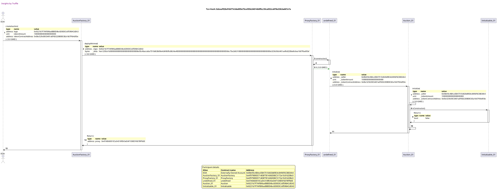
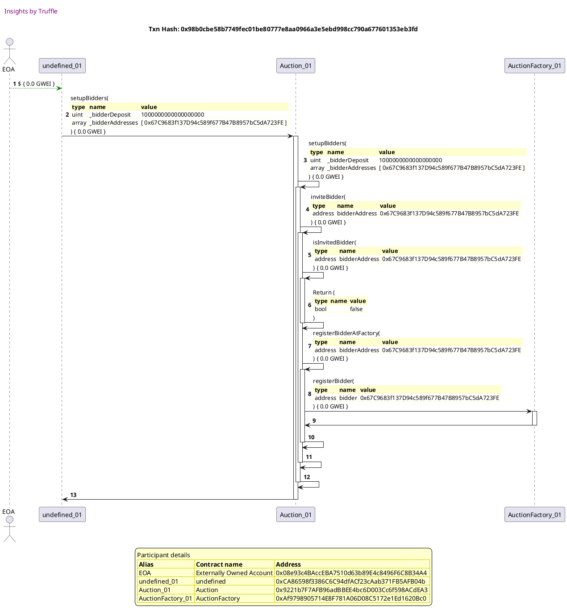
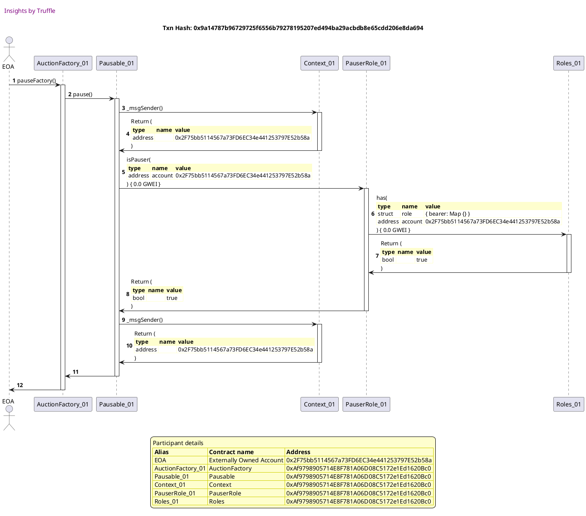
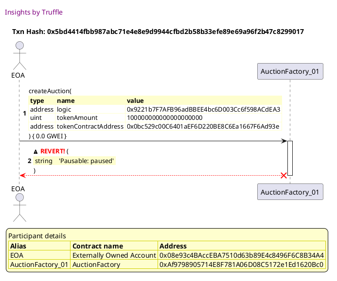

Test date: 2021 Mar 02

## should set msg.sender as admin
[link to test...](https://github.com/michaelsmueller/gloom/blob/main/gloom-core/test/auctionFactory.test.js#L28)

## should create an auction
[link to test...](https://github.com/michaelsmueller/gloom/blob/main/gloom-core/test/auctionFactory.test.js#L33)

##### d1, tx: 0x4a355cd512b2f33c2d076e27efa73a3cd416fac7f948e3a3f3f6053a33f9a0be

[SVG :telescope:](https://www.planttext.com/api/plantuml/svg/xLTVRzj637_NfpYa0zgYotRwTvA2BAYiI6iUYWPRWJsiGt0wKSuXvvCXdJOxzRvxQLbsRSaja1Xxsy4G9Oh78_aZHTgotZQ6rwQTASlYhQbqEykXjfe7gUUyvZEYO0gwc73nCAshLXT9fQgQlCZIB4rIoxfip5B1bKMwTG-yW9fyxXy9ULVLyh7IXgjOoQcUWJQeiJGxWGnVRbJEstgkuE35x_8HYEtjUBUyAAIU4flsh7yxUlbpRuJLdt-Z6pczDmt9b-HZtPObwhMCD0h8nuKcxtXpVq7emkEkxul2jvtSALrNE0KD63W1b3nmkIiApsOb5q4PUI4WetHBHdsySSk8qnnrMbmOD3tz41FUa3EaPnQ6pKWXvnnTZLjXPAMpJcnvH-rERCGzt7HRLulbOCk0TxW1KO5IQYYsqlkCemODB1c9tMXf95VoaUSAji93vfbbTHwJywjZFf4tRow8g84Rw5---gG_MPTzwlpOqwlLByGivq2GQZxhwDzSjNYp5byHnBo6fY4heggf54Zf8d8SEm-o8Cuc4UF5P9AcNYxODQLk8bZfHs6S56diRdMq4frQ4LCzW8vdcCRh9viUMUDJkqq9PcEDliKxDbtGNFXE92XDc4TjdcRisd7e90qJbdARiI1ZSH6vlIEloMT2VwBarp_I6ypROm5Rnt48T1V50kQgMhwNMiwuEZMATyyFOxuqqAaekE58xs7nKhW-vNRkqs-j429NU3aN0d8U-3Ojc9k74NWYz29MCX7chiSz-hJbirm4FZYepFw-v1ObqQ449IiGfHn2mQ13gKJF4QMNns4QuR46wQ2-DdbUwSRKxLhirMjh870Kr_Fp2t9C_PylfZM0_cjypWNvOM3S-9YzWkxiajkQXPFJfW6byDlQPVu6qqaiH3g9lsAQRZ3DM19EN2_s1kLtzwpwk_jl2_3_q9qUkb5ds0ImIGwhOYmsZFkwA7u3qzQQF2_eULKfT11_9LVDrlplWxsfnA74eBQ-KQt7Ez_9Rdo5SBu-ieCiYKE6NsGSL4AMi2JoYZ9EIiSLCS_TmCucFdx6gPSFVHxQksdPQt-ipMndtUvr_W8CbwhPC_cQOZ-WQvDnXCCv06-s6RKpVfTQktrNgsugmkl2GAsvKalouHyC9y7CxxFuATMmhtWyLGrvdVAuZ88eZAWVs5uQPa5ennHxMvZuTk20dHOsmvGNz53vSFewv9oW-61Astjy8hX70d4GWISszdrrewblm7ggQiojFiEijtZ5_nXV0000)

## should get auction addresses including new contract
[link to test...](https://github.com/michaelsmueller/gloom/blob/main/gloom-core/test/auctionFactory.test.js#L40)

##### d1, tx: 0xbaaf92bd10d77e5da895e75ce959e34014b8f9cc55ca552ce878e33b3ad67a7a

[SVG :telescope:](https://www.planttext.com/api/plantuml/svg/xLTHRzis47xNho3I0MtHPQCiaPA2BAWiKsiUYWPRWJsiGq1I9qS8JHaIjTcfzzzBox9hIsu1nzZR24EKJiVZtVVTYMV7ULiRNfbcfXo7DwRKpKn0vTIFXPxpYi-GWYdeRCpbuxGg6vqbfIehz29bAKkOurpNPgdWna7jU02UGOK-Tuy8lIkhugdKXgjO5LCz0ssinTpi55BxScDotbHp1GSlVY-U0Bd-JdR7iwpGK-JYJlHlEr__t3dXTFlVwhgOFfWQYINwM3LvRkqwfZ0AqCU5Hkzu_N25y49mdaSZaRau2m8W6GyZ0W6H4948F1-xlWZpI4f292Ta924CGl0yuV6C1ZpWZeLC6kiw-n0ZNgCBEryu5ZPJo6BERQXn8qrHwhHLMzvZjrKRI0yNtLNbOjbRqfCTBh2iG5veoBRQ-uAZ3lKy6QZTwi8KN1LFN2ZOAlU55uxJHemkRux5XDwykKAo0cwWU_dga_xaN7UfysCttwn-GMOv1sHdpMVj_3TNZRrPgw-GvRo2kaOhfCff8UsC5z5ev8eW3U9q756UZSUC-KBI2SPU8cbEeZ1ECXPxMnjDOODQ8LC-WevdDetNJou-CeQxjeiIcusLZItUYV422qb6aSGueJPNE4lfP3J2OnOcb76NqY2bSHPvNI2lqMU4VyBerp_OhStROu2jSUmJtQAOmLoLo_U5BcPSdOlY_VDX54i3hOcC6sxd1rYyb1x1t1K4Vsk447dI5rnA43mWjjYe9y88V1dw4Ssf38NdSn-VDWWLCY0miiRSxsjkMP8jIv3JpB8a89GKMfPo6xbbwULncWPyh4awgAzDdfUwDbMpLdlrskaf7ENryl8A7JF_vujf1Q3_6kvpXNxeEJVSPg-WMx-ARSt2sMbJWrBsszfc_eRJSImb6yTVEMKRJbEQX6FFZ_rU-Tq_g_xk_zi2_1-wyw4Rd0mR0Elai2g6QdtSrqNn6vYcqkXve8koL3P0-ykvghVkVv_iJINsDNgrzOrgFNxodHt6LmhdworRolmWnfHYxBA44zzpmvp512Pnwav2HbAAWp3D1MFzcFl-RexiTJpEfhTpxlPE_WmCBrIzv_84s_C0hrssBPpj0-pDDgDspkzIQxVkPjLsHVQwC51fhjGIVVZ7mebivdTPV4erx1iUTbLzMMiypgCW2YDC0jTdOHg4hWLmWiE4kC48N9QvrAQyn8V6-ztNeUGCmmTTsjxZYUGU0U80WHCFzdrpWwwl9phLjCsjBiESj_Pg_sDy0G00)

## should register bidder when bidder is set up at auction instance
[link to test...](https://github.com/michaelsmueller/gloom/blob/main/gloom-core/test/auctionFactory.test.js#L51)

##### d1, tx: 0xe3d02bb115cb19930e94fd13219017534e38d5db0583e3ca471096e2f977950e

[SVG :telescope:](https://www.planttext.com/api/plantuml/svg/xLVVRzis47xNNq6a0zgYoqRg1oK5ML19aTOy50ss0djOXu0YJuuGcZ8aQhDJxtyl9SkkBRa54cDl8mnHEXsFTzzt9vujwssZMQtRkRGirkfAjVCSQgjvADM2rMoE9Cn0YPZnXrbTjKeabQngz29BipH9BUkoqIi9LnRgnpqm0JNwF3mYzAwgoyTAQIOZMSxK79Gs5WkzKyZCout9HLil91oy-Bry14JSdUoM2L6g6I9u4FtRpvS_3qvOm_utgYbdzxf1-GfzhDkYC7OjNMe9wEDIeNUikRz0U0cEm7QU4-Bnd8IXWo5q2q4ScuIO-9xZWXC8J-JO2nnmE7DzWaCATX7wVkXXOzDYN1lNqmyHOWqwC_EPPM3J9IyNp8GQjLoNbSfwjTKT9htQH7guwBQkbglHaf7iS85X1OfIWTXgxmkEEZJoPA9seqfTCba-ibp2LdaiFBEiFc9qVdKi9lJcpGNYDJ0DmyjNdzGdwt98dH-7-Mhz2zAh1I0pApRlvx-PRCrDfxv6XlCQcWQjaQnc9JSpNeQsJN8_ywCi3YaJSPocRixfDSPEmcdXXK6KY3HojZRQqWIrHhfw01NDJHftJmGV6TDT-qM9oSRQn1Rjn7Y9S-xP8SSueIucBCtejMtZE0qIcZ92gP_HI8JE4CXhz1dXdp3wzO_qnkJjCS0w7CT4zoWAMCXgzRvKvPp9Kr6yUpwC-Kf3Rq8mpSny3ykNtF4m8xc7lpK221tkvenpo9dl4IoeamSXk3nmGrfG7kIEorpyjE7HdFiUsCOO-RxcbYNUimG55OQb709EeMUfC94RbbuUfsd2HqVIGNrjyhnIZQxRJktLQskaS9JNy_CBTCpydozcDO3wQxhF1VfXvDnqcxs2xlqgjpKB9wTD0rAQRskV-HjEuuZpD8w-SffkECre4iIE6xcZyhjxLltT_RS5-3zqfqCtEHas03R9OLLCrSQuTqNn6-YsLkXveETL9Ks0vbSmsMpT_pxPcqeSQungwnlLUlpaEpcChnGkkYrxodZNTD2KnuKj6BNDXurSHuv3VJSYWPyMc3WySkrq7FFOtysHtSLZRNexwtRlv1UWMIcRFPUliJaFSEUoQU5C7s1kjXcrStwNMhjrL-k-ApBNfOPQCIbNwCC_1avaCd_8ugTKmxxXQLSrblN68zEdXK68FP-uQP3v0OcmETk2n2E-3IGLnA0OStneVDnz7KfEC7pGfUqzFf7S8q0S8F34WttVtAJh6ucUQjharf1XrbjpDVynlW00)

##### d2, tx: 0x98b0cbe58b7749fec01be80777e8aa0966a3e5ebd998cc790a677601353eb3fd

[SVG :telescope:](https://www.planttext.com/api/plantuml/svg/xLPTRzis57tdho3IFQpeib7M1yaW2qefqfgd5bs1FRH5GP6KGrIc395gupRxxxsMLKVs0XGBkeS24mHHlBeyFEUGu1L2JtsGVHXMBK9o29qRLhNfaNzltLhsSeLRipHEvrAzN_RTu7JHjLsF7rLbLHObGkS-R5fpWV1uNHkfJOy_JrsCdtMz_TIv85lHsgLR6HS0iGdxX0e-xY3NGxzkpS67F-qdWwDa7tiXjRPkYICoXVuUs_FV9X9ecl_AURky3XxN6_og7ve6S56meJNurOt3pwI_FiFaXhEQgDgahAOquOrH9AeD8vHImwGaFCjaR59JQywPKfGJcL6QaIXEOrF7ZKPWcGf0lNmkiFJu1DeJ1BO5g-nQWbJmopJM6VsEH6F6F72OAWOLREU-9jvrxqshneatHzbtqHE4HZRuzFMZPM-CUtjwSJGxFiC_uS-O_4hm7t-LL-3bqVVjY1aD_EJ96VOc3ElSQd3P__p6lK7dqqxuPMelRd_7ORCs65edLsFxGRO3l6pJR_5WGSKjVbUF89TctNcx3KJa7zVN8RBlvUPkZD2wDzuR3w7Ni8mPBNZ6uYQAwILFLCfu0-kK9pHdFALraMf15t5LuhSxmCT7gkSQ_zUyqspT1nlCJlJ3DCiTO-1xe03w_uBzmxZxgv6z_l7edvwUuPUmtNg77qQxxheMECBToDPFuSVVzgmtI-k3wNUMYJ2T93-8TxDpxnurtqV4zsC_PtlV1lZs5lblCevE_sqEsbL_z69MWRG9qhP-vkWbkOIJQ-ie57aeH_1IGFNkGUVUs_qUs8-xk1th9ZnlOAcSRDiDVluHfiT2AVZJ2AFZX1aUgoI7M9aBcaP4Pt7DU9aebl2ioWgMnub83e4FwkwiEq8MWcKfPqqSiwp82fxeHXJD8bP2rZ6DgZmLLKwI-X1oLf_tdH6EBnPHJIiAWtWcTPwNPLAh32o92vKrC9CeT2dYU-5cTVmuDeABXbFEE4bfb9IieYmI1A1PaKPqOQ9IHzc2v0hA1e9rcbOBFOKd_D5z0G00)

## should allow admin to pause to stop ability to deploy new auctions
[link to test...](https://github.com/michaelsmueller/gloom/blob/main/gloom-core/test/auctionFactory.test.js#L60)

##### d1, tx: 0x9a14787b96729725f6556b79278195207ed494ba29acbdb8e65cdd206e8da694

[SVG :telescope:](https://www.planttext.com/api/plantuml/svg/tLRVRzem47xtNt7gNZfrtPmqFr67IcbO-p2rQYljfLBb90QY1WVPpWQ5_k-xX12ImYQjR2z3AESxV_vodpdx8EHCQIPrFaa9ORdEH3u9kIJgAH5J9ja4KZxY8ZvdqTD8Phc8-rcQINWt20P1Fo3aLEbvohi4oi-OivXBM5Gkm6Kca-TCQ9RsqcGa9bneP1pg6Z30oHNbD9VJbBScxf9d3ePLnsvO72TY10QjGY-bFVrK9K6gzry9bOp6Ma4uXtkP3uV8ItIYKmxtCm6NJ8qxG6S-CopNSqFVSKtVDUsXOzjEwFgcwnc-RLANnvPlXSpqMHJ6eSSTEufZaphSYvdZMmItBDAOUd3T0wRW0Eq1mMtJIPHC6KhjvP5ECZ4eOVD7QfImhMXxqGtB5GjJleOt_3QmZrl4PtgDsxZRV5pUPct6Ej865q6rngsT0q9ARN3StPKz71rrO5fmLi73zsGNh5ZT5BDPLonepHJGXfuI-JXHepkiHIuBU7DsY_Zuk0EtNETImE63U22dLRr-g6nt-HdqVCe1hM2JqdvdQOw30hu4B3J9bO8bu9VEp85hXw5j69RjkCmz6LmuGV_4ufPbcFQ9wxk1ROQsnrRBTubfRtcf9r6huBuPiYZ2WwdVaYWiW7wayELRS8LdwNMIHTvr2PGfZvbwMxPAIwm7J54Y7ve5X9n9BZlmbKrXyG8l_rBNHiIEdsBlMWcpB5qL2ehahH9ujPb_jqP_yzx_znpjkbOmoL_UDwjhgq2GLISZDutRBkQQ9QbgwBgW5vJIGXSsBBm3SL3ia4JQMc5lBQfUrrsMFG2VCysbO6awX-iVWiVGUrCHDuctUyZhM4dU6_gkx_dKTWqhy0ROmdhKkQ1UtpPSanj1R3WcFOzecxpPQpRU7eIDdbGxU-QtwLrDVm_IkiTLmp-bmYggQecSuHF_E_q4)

##### d2, tx: 0x5bd4414fbb987abc71e4e8e9d9944cfbd2b58b33efe89e69a96f2b47c8299017

[SVG :telescope:](https://www.planttext.com/api/plantuml/svg/TLHHJzim47xthxY1DBOoXfEcILnr5Mbm1ayWXhQ7CKsExPI8rAaI1rhe_lkkQQXWT5Raiy_dy_dxFeUGazgAoZQpWX3HsD8qirHNfBxBpLnKOWQ5dcgZ9aBUJQkoCIekYxA2_OGdFEQ4Z6gxBFIOGDjkjL2wWgTk2d1MLlbZQQmeeYAVcfas5ZDcTXkGuE8cvRofveL-jV0jVzJWU5lVfL0gDrDmQEVwqzhHSLS4wSu_DtK-lRKrf4kuhfeimxp4vhRGSBqmS2Rgso7GnI1LdkTuMPgoC12f31pjwL0pnPZdoInLRZe8qtvVPpfascU2-PcRUe4CNSQe4n24J5eidLz486hOGxj743QRotmkyAfH8srUcgGDM_wcJXlsnhj7IBiNZiQxLk7mS0YoqiBgRl73ZRaXeuw4JvqThxw0NSure3LYrjfxKJGuM8Ul0D6hT5t32efocakqTC5Srqc398YI2VE5camuzrBfdrBQZwMV3LWOnOf7_USSJOxNMe4jxxI9PYY8zSoXEzhRKzjDCV9QuTsYhPikQ2e7BfEKnhv77S4J_zHrwOI7iS-5u_j1uaUAzRkBV8Gde9yfVFt1pr41km1R7FtShxJwjSPp0-pH44Rl7qHbK3zZ6CcDYZ5ctEjTyU_ywlfThpSwRlrZ-0--KDjghRyLu7TmAPfQf8KUmXn7MXrqvH6biPJy7kdQpVNcIP7B5q9Hsegyg5-SUKgH0xhc55yEgWO7pz1jsTrYkDs7DQx5YFt2wig8ebZ2nOFH2Y8fExOGRnHvNteJzF5950mSgln-6ZBkoT1ZVkB7uQJlHTxhn6_5_A-lJHvbB60XeuF0yNYO1A4JKTHJ60-SmDKELuwFt4hK1q4KEYp82VRu4_eB)

