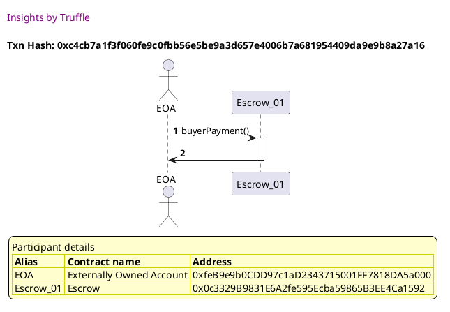
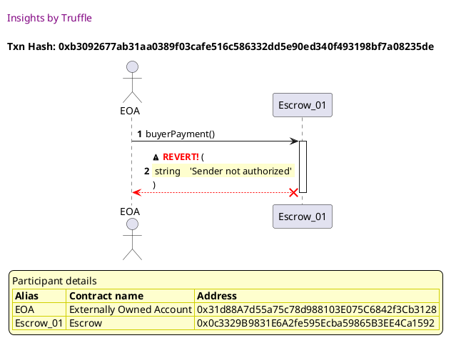
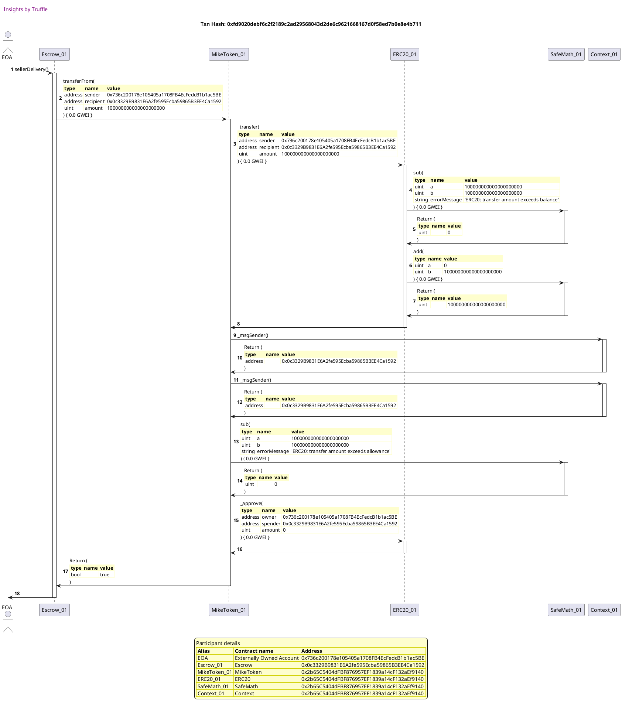
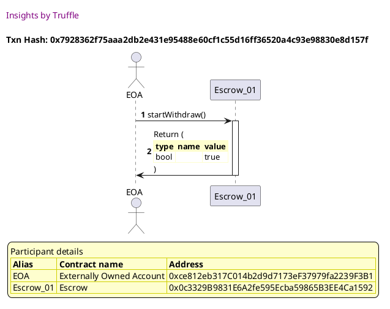
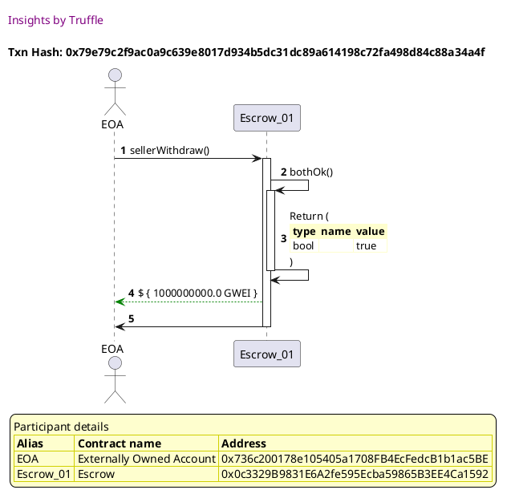
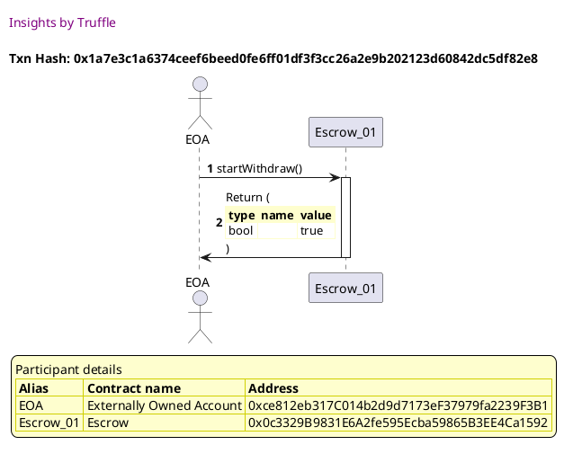
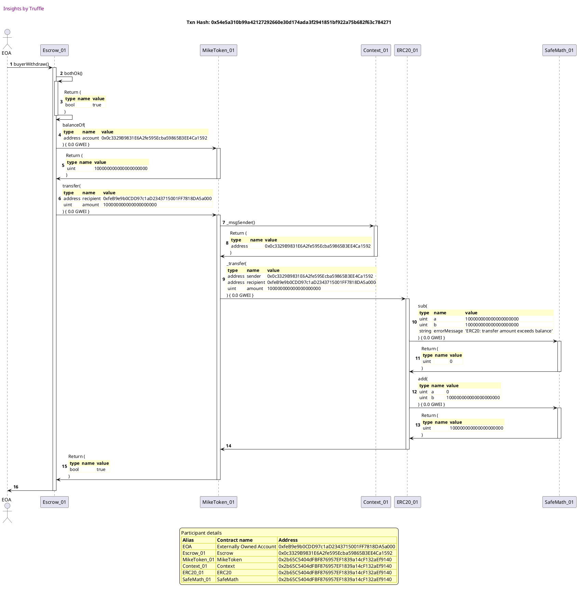

Test date: 2021 Mar 02

## should allow seller and buyer to check winning bid
[link to test...](https://github.com/michaelsmueller/gloom/blob/main/gloom-core/test/escrow.test.js#L34)

## should not allow someone other than seller or buyer to check winning bid
[link to test...](https://github.com/michaelsmueller/gloom/blob/main/gloom-core/test/escrow.test.js#L41)

## should accept correct payment from the buyer
[link to test...](https://github.com/michaelsmueller/gloom/blob/main/gloom-core/test/escrow.test.js#L45)

##### d1, tx: 0xc4cb7a1f3f060fe9c0fbb56e5be9a3d657e4006b7a681954409da9e9b8a27a16

[SVG :telescope:](https://www.planttext.com/api/plantuml/svg/NL9DRzim3BthLn3fPKDNJ8u_OWLPK2Tsq9qQOBqFj4mdHXqva6KqwTh_FiPnWxGww8EFV2GV9SHzwz2wRbSBWPrhJBVBoOhskJ9xjBY3cZPaYWNgvurjEbCicxgnSBFALjao4sBMkcDDSm7zsX8MPE7Vy0HuQ6prsXY7TL9N6xCZuvYnT1U75ODdodrdzpLz0lvKhmHUSB6jiIWgim5F3gRt_fpz78eGG_xVfgqsMzT2VeGdsvKbymfNkPhWwM3W0Tlj5EH11pgVe5VwfOnaIKhBCi_3YCAS5Ff554uea39YdoZsL1W4KXMeIEKnZZak4YoPTbnwzfW0jZ3YSoHODbVfQe_SQjPgsxpybTuP_dYDXEXzuMv-RONRsodatP7i6eydgRvz5zTmxzs7tKr1YFDanFegNq4EgxeLis4-FsvIcKefvs-_W0V0HV1boSfQBXmCxkXaI8h2KilO9Mx-rlV4-y6HDLZNHtXyCLH0eZN_0iUGF9IqEAaXbscg9jh3TEm7_iGBfVHMgqdinMaI8cV_GdpHvEFUaqdj-sErKB7lPL4oBYbKOQPp35KSXGi_ou8bUg4QCnbtFVGkxdddl_iV)

## should not accept payment from someone other than buyer
[link to test...](https://github.com/michaelsmueller/gloom/blob/main/gloom-core/test/escrow.test.js#L55)

##### d1, tx: 0xb3092677ab31aa0389f03cafe516c586332dd5e90ed340f493198bf7a08235de

[SVG :telescope:](https://www.planttext.com/api/plantuml/svg/NLDHJzim47xthxY1DA0CuSHDurHTH2b1x0a4rLx6D5rYfur8dSfnHikw_xvh6ggoAFBPTxxFlkyxCtPLExIkMPICOUCgqonIRLdzKfWbMbn0gMVQg6lCNcQsQeoQL6LbuVWskKqc2MEZsgrB7JDelxb6fItywPO0TvKjtYhZi1oNnSmij764cBlzXbiAxY2NZLsM-aFWgNZJuFNtlWTKgZ0py7Zd-jlQqMLt2TQT_ytKnMpkQaZNCBLDdXCkSuKhDKnN1kwmdW-1hrB18tyGXfWA3v4B6ULSP9Zhm1jaWHm8uIiLw8Xh9VeyxqV2YsIQXyYbBm95c0mpHrTFxiU0DHoHFM94cokoOebKQb9djdhznRrT-7rrn5Yx5oxYGo-SdmyXRTRQFk1wIzNf6JiChov-75kjVhPPRVh544QVNz4QOYM6KRRJXlR4lTvZyZrvd7xgzKQNhJ-6qsVpp4QTT5yw6s-WTdRBwWReFtaYjOb2KpcWVfXlzTFg13RRt3EcD5LS_4QdFvQpwnBsS52xqWwBiZuuy8RVSCxZpLUWPY12Q38XbIr1Wi65tZh6IbbTKsoVHnVSyalZocbhi2pNSFzgj89nbb57EWhnbV2KbEDG1G66GHPA5KdfSP7mC9WCPD_FnOHKzkL_m7jztkSj6Cz8-kWwai9B1cEV6Y8AaYp589A3u5eaIN-2NX3v14PLTxMpAnhf7Vq3)

## should not show both ok after only buyer payment
[link to test...](https://github.com/michaelsmueller/gloom/blob/main/gloom-core/test/escrow.test.js#L62)

## should accept correct token transfer from the seller
[link to test...](https://github.com/michaelsmueller/gloom/blob/main/gloom-core/test/escrow.test.js#L67)

##### d1, tx: 0xfd9020debf6c2f2189c2ad29568043d2de6c9621668167d0f58ed7b0e8e4b711

[SVG :telescope:](https://www.planttext.com/api/plantuml/svg/vLTHRzCm47xthx360qmmiDCaJQOnqNO9y321s2HUa92JNBfegLCvpjP2-UzSqgHDIiKeGKA2FCG--_Bv_DtvV27aLQw5qiKi9KGKEfF5B015yjj4peKICvh256Gq5k7jL6M5Z2PPcYdwoFTyR-8HSfRhPGhdX5RF3OW85FrQYvI-oLJo9PDQfACqcSePI8s8iTue-3YvXfmNQfv2P-8g-GAKcvknzoAA4ZcbdDL3twhsx4Lj1AdNVolpP7gZSneiwRKguXXnYKvq2lHw8UaRaT-SKhQ88vSPB88WjaCZDhZZXeQ83DUo7MOE8YC2EtHjWzksm-rXn6BBWMWOC73038QS4wGir6Ywzsv4HKwFi3qYI9jEmcGkSAjU7ghi_ZFZw-b6wYfT9hTmdTs2RFJQ0pju7oO6sy3LGbVbIiHmAVHDezMIkueJ91WMkj7RYaU4L3kX9-Tjc-dJfwSqXpG5TG5fSWTg-UIOj1LA_OxjrITQ2Pd7e7oLpPvyaf_8MHqyp-hsVFMIwkKSABPIpAhsJgG5Tahr5KMlAyXpkiBbPUdV5JflE42dCSQ73d1ccSmIVCWSVsnweGzHEEO15w4rzdu4KO0C96KabZWi70mCT-mw0-xP8oC6oxMyC12MwzZMUE1vvaHmopKQd2AfFXGpF0nbXxCzprhvc7wbx3cZhpzwRp5KTxYfs6rSM37rkQ7g_wPfIqf9KJj-ro5O1B_7JsFIpwtPw0KFwULQbSbeHK6fJ5qYQsAAYz77rGQsWT-G08iG8CAa958XGtYyV_UT_NPZvEJab7u0NIX9Up5GEhHU_46sCHvwitqWit-7aPyPjClIpa568_OTxbP6NH_lMJwzgavccJVRi_inUsriUuv_u_WU_mVR-VVoYaZJxFwGpFA7VRGlkpnuvOdvN6Ltq3SgidlP-yBBvzjhi-zrzqjNsw-baNQ1rTT5GPQbQnTfrOp-MCEjYx_I7BAk_idxLjqOWHP9chSMls0N6BxbubZaOos9dJ8TA2oEDsQC6fettvslghePtmiDIcBqBkaxT6D4Hs7Oq7Y0Epl0cxgxwH_erJPOfpvlYHMa4TZM1Eqo8t_iEqFRjOQUpvs1AxWP-dnW22zskSbsx6lg-BhR0wfTxs-b7e2j_uADS2WSnamTEUGLll7lyZi0)

## seller and buyer can confirm find bothOk after payment and token delivery
[link to test...](https://github.com/michaelsmueller/gloom/blob/main/gloom-core/test/escrow.test.js#L75)

## should not allow someone other than seller or buyer to check bothOk
[link to test...](https://github.com/michaelsmueller/gloom/blob/main/gloom-core/test/escrow.test.js#L81)

## should allow seller to withdraw winning bid payment
[link to test...](https://github.com/michaelsmueller/gloom/blob/main/gloom-core/test/escrow.test.js#L85)

##### d1, tx: 0x7928362f75aaa2db2e431e95488e60cf1c55d16ff36520a4c93e98830e8d157f

[SVG :telescope:](https://www.planttext.com/api/plantuml/svg/NLDjRzem4FxkNt5YNrfrrVn2NemOAj2WxbEhhTA-L9gS-09HZOCSPq3B_llS411R5FavttD-pdUN47BNUELykpQ4gDRNjbtdw4ZpMjcDSceD1fTezKmLhqjNjrRFQrCx-BJ85jay8sJS-Bt12O7kMQ7IwE2ztm8yrAvwgwrNPcggfLsZzK6nzEU0HI2FaflMRGp-G_oetX3OyEnxKbfNTWcCzgu_7Ow_z9SWVVvljgcMAzz0leTdrvPbq2M-yWRXUMVXGJMh4T1T8dagObucaLAAwvpZK32KqJ1DCQP5oOeeqYmkIn57dAfX8GNAD1KKKysYf2IXPOKFLyyUfw0Q60GSaD0sNnNLHeLIiwPmzVONPKVwj1iGqiN2xUJI2pSt8-Z6yRFoA-tKzkgQNF9TU7VkTWJVqRVEmjMBVI7ZVXwVUvmSleBVRn02MhNkyBSoRJ0-mW-GrxM10uJNkvFtcf3ZiCdJHGaQlQfCSv7YdjvJIZzIX9c6ke8n3yDoeHVdP5Ej7JQ1Ev-R7BesXNNdqLbbp1uUjnOrJ8iYV5W-K7HNOCeuve8bSyg6ETTI9omHk129J6IfE1To8MRiF-5pcqzs9qOB8RYSoLImB9xo4YCPPKMk8fd6qKnasN2kM2Hv40jLzxMJkx26t-4l)

##### d2, tx: 0x79e79c2f9ac0a9c639e8017d934b5dc31dc89a614198c72fa498d84c88a34a4f

[SVG :telescope:](https://www.planttext.com/api/plantuml/svg/VLFVRzem47xtNt6YU-ZKTOj90Z7gK866jKzKMwK-hDDqs0v460SvJe6M_U-xfW6nRfeL-UoxotVV_J1ZbwL7vwkbOGmhNzXgETMEbOlShj3X4eoUQQk6A1SpLrHMZGfJE3WPf-Dqb39sKVgjqNq6zPfhLDh1StC5k2vS_bHOZsPWyfbTQki9CVC7Xp4PNo5NbLiP_OVXM_waWKS7tIqgbTiPyA1H_QhbnQU616lYtzWodyrz2TCjtBagomYN-TmR3NSR2zTOpdiGRBf2TuLiPm9bW49sGg6JW7UL2ADfh6J8bKm4TdZ4HIAxxGmZaQWaaac2OOHHngXaqXFrT380BA55iiMeR3wN-GefrRIKhbZ_3FYhUNzhCLRxmdd_M0jdPpqejJ7QtUT-hXokJz-pOuT_-4yBFvyi_kztVjw3hzfNpiBfWtrW5qtxFZIol_iCVhlIGDBYifQFQ2ewlBZlA4XXO0VqURVNledu_MJcjBO_wj0lkVNW7JnJg_RhOm1VxjCRwjbVJEjI44V6NgUDtHxLK6cFkIcFI5y5LuJtGfg6YWfBXn5DYwDc7EWFb7Aw9DlXl_wkxXFj6w-THMEsC5bRhM0W9Kss9nFDHDYHxO2c8D4yYACWHjuDal4mIkLOApdaKuuo7gPlW0zztfzhi426OLiCHHBoj3DePpeMSIgd68ka4m_3D8r6o6FH9Z3AkicTNT9Ex_4t)

## should allow buyer to withdraw tokens
[link to test...](https://github.com/michaelsmueller/gloom/blob/main/gloom-core/test/escrow.test.js#L96)

##### d1, tx: 0x1a7e3c1a6374ceef6beed0fe6ff01df3f3cc26a2e9b202123d60842dc5df82e8

[SVG :telescope:](https://www.planttext.com/api/plantuml/svg/NLDjRzem4FxkNt5YNrfrrVn2tX131HhKVMgrLTgNIfDZNo2gSP3Z36ZPVvyR0cAB8Z_dUyxF-UuIGkuQBvrlruOGsVhQjki27MbUAxkHJgx1u1AjdadrkdHrQ_MyDhM3JujyaSzpGiQDtnkS4EYU5KgD3jxxBS13xQgtsdfffgPQsZLQ7nHBVmvO1F8ekMdTnk0_n8_g3O4DpxudgNLbby1ex_hJuVXBVmdIv_zccsgvyWqKUtXsRLa6NU8hRn2UTnOUPBCQ0TqncQ1GJCOY6Ih4CYuGDIqnBalAT2bAeHIF9SUiu9GpBdHCqo7NAj9boZ4beMNAXwldZrEG3Gm23aXecwzKjP6XrBnHhjx-ekn8dtO3GhfOk9rSUk7cPWJTE7vMVgMTt5vTaqk-2-_EtOxWE_hMMRXwiIzatC_ZSu-JmrVm-mr2G2lN7VwMfWt6H_W1YhesS83mUdVoNXDo73PvkYX1evULQIvItDDxIkb7YZ3JK5Smvc5OBlJYd6ogjSCcSETpaqFNfh3kF3ehZTd3uzQYXgbIuSFoWQ8xXIdZM0YMp2aR5bndEc69m8L8iYGh9USYMuWP-q_utEQJtObH9GJFPbagM1vFUObH5kMga56Mnj5CvFbmBbcKyI0Mgkvh9tTX3R_3Nm00)

##### d2, tx: 0x54e5a310b99a42127292660e30d174ada3f2941851bf922a75b682f63c784271

[SVG :telescope:](https://www.planttext.com/api/plantuml/svg/pLTjRvj84Fw-lsAL-z1MlLnPNWn4QLI_mBKVebHDf7wfL0smsCXuiNQNncvz__t6630aKTwSqnKXTeSTppppC3ix9kI3qY1rkSW9WL8Nebn4N18rpyGI92nepgTS92E8vrDPb28P5taXwHzX40RZW91JfTSvFoEqkcOS4Yxfhrgaz6CXiv-5q90Fysmg5bnej9ZgLY74nPt9PIcNEUyjN6O_EMLs--up94acffGPzQj_gl7qNGs2rFu_2PLDPrhHQ4slP9ccQ9VeJEUSNgq4_GXgTaADbMDp1oncHBuFjibCr_JDmS3Wbf4mruO4hDJqRUOvB4fzqmJNYGQUcGwisFLiqsK4AOirGWykXXGKFSBnY21jEekp9M2eWOfbSVtTOBlbHkehdMTpVbNCkMZqkY_wgcCaXQzqexWNRxZzCZQDrcijz5Kk8UNde6UDLaS-8gIAX1wVTJ7JjszFQ5IkkVoQwLaYuVhr6z9TlqkzqBEB-VrwnySdz0lNfHJqzJVnZPpMkVLdFPvjtbEzNdAAeu15DVw0lCJ9Lds3JegSRYZUMZPlRtliaRe31pc8c5-aptEBkIYvKkWMuXXtXiQPiJ9YopBzaUzPB1WCpPGxlXF44JY-Dt16LX3OOs2ERzOmwIzg_6NGlxy6dp2PRu1yQQBAh0A9DpFkk1xFd9OWLChbeSH9ZjcOyPgwb8zyxaV6U3BntPZ1nBHiosMEOR0mT3tcJOOEj3ZRS61HatzVK0_otDbALOZV5sfwYOKFWqH6kgktAJdum-mPUKuEtPaspQRV1VDI7qnLZ3m3v6_nrVUaR2dgLhoA9LL61-qhk1zDgnSzfAUqt9vo6ygbBEGviWPJT4PVLG7ijrz30b_5d2UgAMYlxew-5sy_HrwmidIgoFriOpuSpFOJcVr_67cWrlPOkbrN_kipuN67vwuTsC8XktwGVExq4WdNaEMgutnYJ338hNDi-x2zmCcsX4fibreOmwOWjByxsrIT53vNcai1URwc5zU29tJOEM4VNp1wXjjEh9a_iOfrZVKwjevOcJIZWJDsRCDEmb7ekGFVSOEGUPOFp8v3PfaGf3wpR-3hT7QjS82vjWEifmUOwdQAU-cf1Z5dwimX7_29_pV-1G00)

